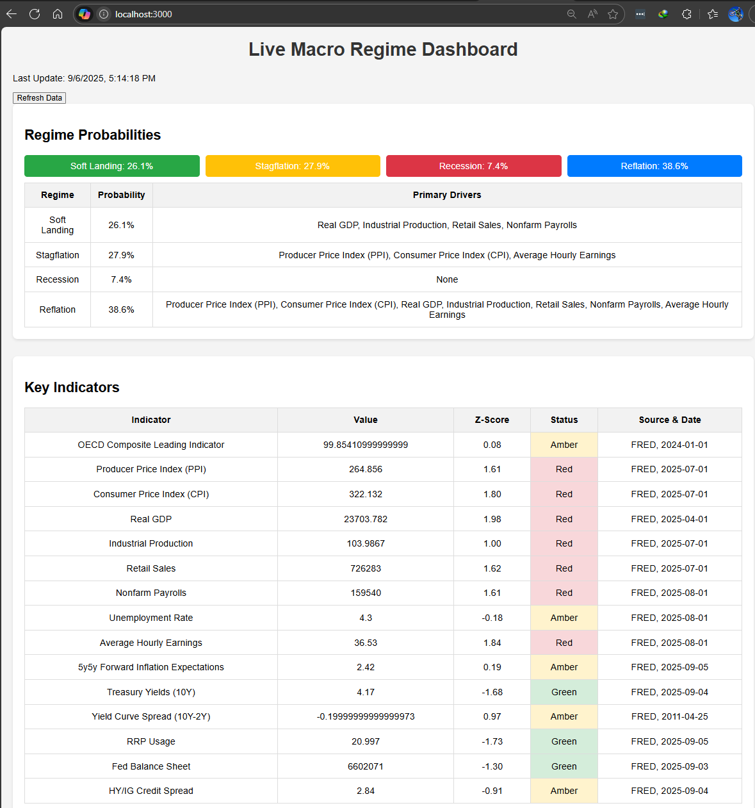

# Live Macro Regime Dashboard

This project is a web-based dashboard that provides a real-time view of the current macroeconomic regime. It fetches key economic indicators from the Federal Reserve Economic Data (FRED) API, analyzes them, and calculates the probabilities of four different macroeconomic regimes: Soft Landing, Stagflation, Recession, and Reflation.

## What it does

The dashboard is designed to give a quick, data-driven snapshot of the economy's health. It does this by:

- **Fetching Key Indicators:** It pulls data for a curated list of economic indicators covering growth, inflation, policy, liquidity, risk, and credit.
- **Calculating Z-Scores:** For each indicator, it calculates a Z-score to show how the current value deviates from its historical average. This helps in identifying anomalies and trends.
- **Determining Macro Regimes:** Based on the patterns in the indicators, it scores four potential economic regimes and converts these scores into probabilities using a softmax function.
- **Providing Actionable Insights:** The dashboard displays:
    - Regime probabilities in a clear, visual format.
    - A detailed table of key indicators with their values, Z-scores, and status.
    - Portfolio tilt suggestions tailored to each regime.
    - Alerts for significant economic events, like a yield curve inversion.
    - A narrative summary of the current economic situation.
- **Generating Markdown:** It also generates a clean Markdown summary of the dashboard's content.

## How it is useful

This tool is useful for anyone interested in economics, finance, or investing. It provides a structured and automated way to:

- **Monitor the economy:** Keep track of important economic data without having to manually check multiple sources.
- **Understand the big picture:** The regime analysis helps in understanding the broader economic context beyond individual data points.
- **Make informed decisions:** The portfolio suggestions and alerts can serve as inputs for financial and investment decisions.
- **Automate reporting:** The generated Markdown can be easily copied and used for reports or personal notes.

## How to run it

1.  **Install dependencies:**
    ```bash
    npm install
    ```
2.  **Start the server:**
    ```bash
    node server.js
    ```
3.  **Open the dashboard:**
    Open your web browser and navigate to `http://localhost:3000`.

The dashboard will load the latest data automatically. You can click the "Refresh Data" button to fetch the most recent data from the FRED API.
